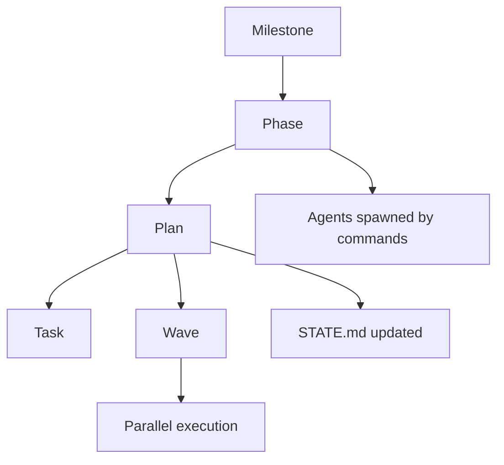

# Phase 01: Information Architecture - Research

**Researched:** 2026-03-19
**Domain:** Technical documentation information architecture (plain GFM markdown, no build pipeline)
**Confidence:** HIGH

## Summary

This phase is documentation-only: create a `docs/` folder structure, restructure `README.md` as an entry point, and write four foundational pages (getting started, core concepts, glossary). No code changes. No build tooling. All output must be plain GitHub-Flavored Markdown that `vit-doc-updater` can write and GitHub can render natively.

The domain is well-established. The research confirmed: two-audience separation (user guide / developer guide) is the standard pattern for CLIs and frameworks targeting both end-users and contributors. Mermaid is GitHub-native and requires no tooling to render. The Diátaxis framework (tutorials, how-to guides, reference, explanation) provides the right mental model for organizing the page types required by IA-01 through IA-05.

The core risk is writing the wrong kind of content for each page. Getting started must be tutorial-oriented (doing, not explaining). Core concepts must be explanation-oriented (mental model, not instructions). Glossary is pure reference. README is orientation, not documentation.

**Primary recommendation:** Create `docs/user-guide/` and `docs/developer-guide/` as the top-level split; use Diátaxis page type discipline to keep each page focused on one purpose; write the getting started guide as a literal walkthrough, not a concepts page.

---

## Standard Stack

This phase has no libraries. The "stack" is file naming and markup conventions.

### Core Tools

| Tool | Version | Purpose | Why Standard |
|------|---------|---------|--------------|
| GitHub-Flavored Markdown (GFM) | N/A | All page content | Already decided; vit-doc-updater must write plain markdown |
| Mermaid (via fenced code blocks) | Bundled with GitHub | Diagrams in markdown | GitHub-native rendering, no build step required |

### Mermaid Diagram Support (HIGH confidence)

GitHub natively renders Mermaid in any `.md` file using the fenced code block syntax:

````

````

Supported in: GitHub Issues, Discussions, PRs, wikis, and Markdown files. Confirmed via GitHub official docs.

### Alternatives Considered

| Instead of | Could Use | Tradeoff |
|------------|-----------|----------|
| docs/ folder | wiki | Wiki is separate from codebase, can't be committed or agent-updated |
| docs/ folder | VitePress site | Deferred to v1.2 per REQUIREMENTS.md (out of scope) |
| Mermaid | ASCII art diagrams | Less readable, harder to maintain |
| Mermaid | External diagram images | Requires separate tooling, not agent-writable |

**Installation:** None required. Plain markdown files only.

---

## Architecture Patterns

### Recommended docs/ Structure

```
docs/
├── user-guide/
│   ├── README.md            # User guide index (what's here, who it's for)
│   ├── getting-started.md   # IA-03: First-run walkthrough
│   ├── core-concepts.md     # IA-04: Mental model explanation
│   └── glossary.md          # IA-05: Term definitions
└── developer-guide/
    └── README.md            # Developer guide index (placeholder for Phase 04)
```

Root level:
```
README.md        # IA-02: Restructured as entry point with nav to docs/
```

**Rationale for this structure:**
- Two top-level folders signal the audience split immediately (IA-01)
- `user-guide/README.md` serves as the user guide landing page
- `developer-guide/README.md` placeholder is needed now so Phase 01 delivers a complete IA skeleton that Phase 04 fills
- All Phase 01 deliverables (IA-03, IA-04, IA-05) live under `user-guide/`

### Pattern 1: README as Navigation Hub (not Documentation)

**What:** Root `README.md` orients visitors and routes them to the right docs section. It does NOT contain documentation itself.

**When to use:** Always — for any project with a `docs/` folder.

**Structure for VIT README:**
1. One-liner what VIT is
2. Install command (`npx vit-claude`)
3. The core loop (4-command sequence)
4. Navigation table pointing to docs/ sections
5. Brief reference tables (commands, agents) — retained for discoverability

The existing README.md has good content but is not structured as an entry point. It mixes reference tables with conceptual explanation. The restructure should move conceptual explanation to `docs/user-guide/core-concepts.md` and add a "Documentation" section that links to `docs/`.

### Pattern 2: Getting Started as Tutorial (Diátaxis)

**What:** A tutorial is learning-oriented, hands-on, and leads the reader through a specific experience. It does NOT explain how things work — it makes the reader DO something.

**When to use:** For IA-03 (getting started guide).

**Structure:**
```markdown
# Getting Started

## Prerequisites
[What you need before starting — Node.js version, etc.]

## Step 1: Install VIT
[Exact command, what to expect]

## Step 2: Start a new project
[/vit:new-project — what happens, what it produces]

## Step 3: Plan your first phase
[/vit:plan-phase 1 — what happens]

## Step 4: Execute
[/vit:execute-phase 1 — what happens]

## Step 5: Verify
[/vit:verify-work 1 — what happens]

## What's next
[Links to core concepts, command reference]
```

**Anti-pattern to avoid:** Starting with "VIT is a framework that..." — that belongs in core concepts, not getting started.

### Pattern 3: Core Concepts as Explanation (Diátaxis)

**What:** Explanation-oriented content that builds the reader's mental model. Does NOT include instructions or steps.

**When to use:** For IA-04 (core concepts page).

**Structure for VIT mental model:**
```markdown
# Core Concepts

## The VIT Mental Model

[One-paragraph overview of the hierarchy]

## Milestones
[What a milestone is, what it contains, lifecycle]

## Phases
[What a phase is, relationship to milestone, success criteria]

## Plans
[What a plan is, waves, parallel vs sequential]

## Tasks
[What a task is, types (auto, checkpoint)]

## Agents
[What agents are, how they relate to commands, they are spawned not invoked]

## State
[STATE.md, .planning/ folder, how state survives context resets]

## Mermaid diagram: hierarchy
[Visual showing milestone → phase → plan → task]
```

### Pattern 4: Glossary as Reference (Diátaxis)

**What:** Pure reference. Alphabetical. One definition per term. Links to where the term is explained in depth.

**When to use:** For IA-05.

**VIT-specific terms to define** (from codebase research):
- agent
- autonomous (plan frontmatter flag)
- balanced / budget / quality (model profiles)
- checkpoint (task type)
- depends_on
- execute-phase / plan-phase / verify-work (commands — link to command reference)
- files_modified
- milestone
- must_haves / truths / artifacts / key_links
- phase
- plan
- PLAN.md
- STATE.md
- SUMMARY.md
- task
- wave
- yolo (config mode)

### Anti-Patterns to Avoid

- **README as documentation dump:** README should be an entry point, not contain all docs content.
- **Getting started that teaches concepts:** Tutorial readers want to DO, not understand. Move "why" to core concepts.
- **Core concepts that give instructions:** Explanation pages don't have numbered steps.
- **Glossary that explains instead of defines:** Each glossary entry should be 1-3 sentences max. Link to the full page for depth.
- **Single docs/ folder with no audience separation:** Users and developers have different goals. Mixed content means both fail to find what they need.
- **Placeholder developer guide with no README:** Even a stub `developer-guide/README.md` must explain what it is and point to when it will be filled in.

---

## Don't Hand-Roll

This phase has no code, so "don't hand-roll" applies to content decisions:

| Problem | Don't Build | Use Instead | Why |
|---------|-------------|-------------|-----|
| Explaining page types | Custom "guide types" terminology | Diátaxis (tutorial / how-to / reference / explanation) | Proven mental model, well understood |
| Diagram format | ASCII art flow charts | Mermaid fenced code blocks | GitHub-native, version-controlled, maintainable |
| Audience separation | Nested subfolders for every sub-topic | Two top-level dirs (user-guide/, developer-guide/) | Simple, scalable, immediately legible |
| Navigation in README | Long prose linking paragraphs | Markdown table with two columns (section, description) | Scannable, GitHub renders cleanly |

**Key insight:** Documentation information architecture is a solved problem. The Diátaxis framework provides the right content-type discipline. The only custom work is applying it to VIT's specific content.

---

## Common Pitfalls

### Pitfall 1: Writing Reference Before the Guide

**What goes wrong:** The page explains all commands and options before explaining what problem they solve or how to use them in sequence.
**Why it happens:** Reference is easy to write (just list things); tutorial requires narrative.
**How to avoid:** Write getting started first. If you feel like explaining an option in depth, put a link instead.
**Warning signs:** Getting started guide has more than one H2 per step, or contains definition lists.

### Pitfall 2: Conflating Core Concepts with Getting Started

**What goes wrong:** The getting started guide explains the milestone → phase → plan → task hierarchy before showing how to run a command.
**Why it happens:** Writers assume readers need conceptual grounding before they can act.
**How to avoid:** Use the tutorial pattern — do first, explain later. The reader can look up core concepts after they've run their first phase.
**Warning signs:** Getting started guide H1 is followed by H2 "What is VIT?" or "Background."

### Pitfall 3: Glossary Scope Creep

**What goes wrong:** Glossary entries become paragraphs. The glossary becomes a mini-docs site.
**Why it happens:** Terms have nuance and the writer wants to be thorough.
**How to avoid:** Hard limit: 1-3 sentences per glossary entry. Include a link to the full explanation page.
**Warning signs:** Any glossary entry exceeds 5 lines, or has sub-bullets.

### Pitfall 4: Developer Guide Left as Truly Empty

**What goes wrong:** `docs/developer-guide/` exists but is empty, causing broken navigation.
**Why it happens:** Phase 01 focuses on user-facing content; developer guide is Phase 04's scope.
**How to avoid:** Create `docs/developer-guide/README.md` with a single-paragraph placeholder that says what this section covers and that it is coming. Link it from root README.
**Warning signs:** `docs/developer-guide/` directory exists with no files.

### Pitfall 5: README Becomes Longer During Restructure

**What goes wrong:** The restructured README adds a "Documentation" section but doesn't remove any content, making it longer and harder to scan.
**Why it happens:** Reluctance to delete content that exists.
**How to avoid:** When adding navigation links to `docs/`, remove the corresponding conceptual content from README. README should be shorter after restructure, not longer.
**Warning signs:** Restructured README word count exceeds current README word count.

### Pitfall 6: Missing the VIT-Specific Mental Model

**What goes wrong:** Core concepts page explains what commands do (reference), not how to think about the system.
**Why it happens:** Easier to describe behavior than explain the model.
**How to avoid:** The core concepts page must answer: "Why is VIT structured this way? What is the relationship between these concepts?" Include a Mermaid diagram of the hierarchy.
**Warning signs:** Core concepts page reads like a command reference with different words.

---

## Code Examples

### Mermaid Hierarchy Diagram (for core-concepts.md)

```markdown
# Source: GitHub native Mermaid rendering (docs.github.com/creating-diagrams)


```

### README Navigation Table (for root README.md)

```markdown
## Documentation

| Section | Description |
|---------|-------------|
| [Getting Started](docs/user-guide/getting-started.md) | Install VIT and run your first phase |
| [Core Concepts](docs/user-guide/core-concepts.md) | The milestone → phase → plan → task mental model |
| [Glossary](docs/user-guide/glossary.md) | Definitions for all VIT-specific terms |
| [User Guide](docs/user-guide/README.md) | All user-facing documentation |
| [Developer Guide](docs/developer-guide/README.md) | Extending VIT with custom agents and commands |
```

### Glossary Entry Format

```markdown
## wave

A wave is a group of plans that can execute in parallel within a phase. All plans in Wave 1 run simultaneously; Wave 2 starts only after all Wave 1 plans complete. Wave numbers are assigned during `/vit:plan-phase` and stored in plan frontmatter.

See: [Plans](./core-concepts.md#plans), [execute-phase command](../../../.claude/commands/vit/execute-phase.md)
```

### Getting Started Step Format

```markdown
## Step 2: Start a new project

```
/vit:new-project
```

Claude will ask about your project: goals, tech stack, constraints. Answer the questions — VIT uses these to build your `PROJECT.md` and initial roadmap.

**What you get:** `.planning/PROJECT.md`, `.planning/ROADMAP.md`, `.planning/STATE.md`

**Time:** 2-5 minutes
```

---

## State of the Art

| Old Approach | Current Approach | When Changed | Impact |
|--------------|------------------|--------------|--------|
| README-only documentation | README as entry point + docs/ folder | 2020s standard | Better discoverability, scalable |
| Diagram images (PNG/SVG) | Mermaid fenced code blocks | 2022 (GitHub native Mermaid) | Diagrams are version-controlled text |
| Single-audience docs | Two-audience split (user/developer) | Framework era standard | Readers find content relevant to their role |
| Documentation without structure model | Diátaxis (tutorial/how-to/reference/explanation) | 2017-present (mainstream by 2022) | Content type discipline prevents "explain everything everywhere" |

**Not applicable to this phase:**
- Static site generators (VitePress): Deferred to v1.2 per REQUIREMENTS.md
- Auto-generated reference from source: Explicitly out of scope (command files are prose system prompts)

---

## Open Questions

1. **Developer guide scope in Phase 01**
   - What we know: Phase 04 owns DEV-01 through DEV-06; Phase 01 only needs IA-01 (the folder structure exists)
   - What's unclear: Should `docs/developer-guide/README.md` in Phase 01 be a meaningful stub (e.g., "What you'll find here when Phase 04 ships") or a minimal placeholder?
   - Recommendation: Write a 2-3 sentence placeholder that names the content coming (custom agents, commands, templates) so navigation is not a dead end.

2. **Mermaid diagram complexity in core-concepts.md**
   - What we know: GitHub renders Mermaid natively; the hierarchy is milestone → phase → plan → task
   - What's unclear: Should the diagram show the agent spawn relationships too (e.g., vit-planner spawned by plan-phase)?
   - Recommendation: Keep Phase 01 diagram focused on the hierarchy only. Agent relationships belong in Phase 02 (Agent Reference).

3. **README restructure extent**
   - What we know: Current README.md has both an architecture section and a commands/agents reference table
   - What's unclear: Should the architecture section move to docs/developer-guide/ or docs/user-guide/core-concepts.md?
   - Recommendation: The ASCII architecture block in README (`plan-phase → vit-researcher + vit-planner + vit-plan-checker`) is a reference, not explanation. Keep a condensed version in README, link to full architecture docs (Phase 03 scope).

---

## Sources

### Primary (HIGH confidence)
- GitHub official docs — https://docs.github.com/en/get-started/writing-on-github/working-with-advanced-formatting/creating-diagrams — confirmed Mermaid native rendering in markdown files
- VIT codebase — `.claude/commands/vit/`, `.claude/agents/`, `.claude/vit/references/`, `.claude/vit/templates/` — all VIT-specific terms, commands, agents inventoried directly from source

### Secondary (MEDIUM confidence)
- Diátaxis framework (diataxis.fr) — four content types (tutorial, how-to, reference, explanation) verified via official site; glossary placement inferred from framework logic (reference type)
- GitBook documentation structure guide (gitbook.com/docs/guides/docs-best-practices/documentation-structure-tips) — two-audience separation, getting started visibility, Diátaxis adoption confirmed

### Tertiary (LOW confidence)
- WebSearch results for GitHub docs folder structure — community consensus on docs/ folder with README as entry point; corroborated by multiple sources but not from a single authoritative spec

---

## Metadata

**Confidence breakdown:**
- Standard stack (GFM + Mermaid): HIGH — verified via GitHub official documentation
- Architecture (docs/ folder structure, page types): HIGH — derived directly from VIT codebase + established documentation patterns
- Pitfalls: HIGH — derived from Diátaxis content-type discipline + direct analysis of the VIT codebase and requirement specs
- Glossary terms: HIGH — inventoried directly from VIT source files (templates, references, frontmatter schemas)

**Research date:** 2026-03-19
**Valid until:** 2026-04-19 (documentation IA patterns are stable; Mermaid rendering is stable on GitHub)
