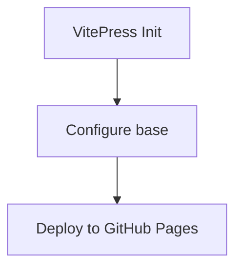

# Phase 01: VitePress Foundation - Research

**Researched:** 2026-03-18
**Domain:** VitePress static site generator, GitHub Pages deployment, Mermaid diagrams
**Confidence:** HIGH (core VitePress), MEDIUM (Mermaid pinning specifics)

## Summary

This phase establishes a VitePress 1.6.4 documentation site deployed to GitHub Pages. VitePress 1.6.4 is the current stable release (v2 is still alpha with active regressions — the version choice is locked). The standard setup places VitePress in a `docs/` subdirectory with its own `package.json`, keeping it separate from the root project. All infrastructure requirements (dark mode, search, Mermaid, ASCII branding, multi-sidebar, CI) are achievable with VitePress's built-in features plus one external plugin.

The primary complexity in this phase is the Mermaid plugin integration. `vitepress-plugin-mermaid` is not SSR-compatible out of the box — Mermaid itself cannot run in Node during SSR. The plugin handles this via a client-only rendering approach, but version mismatches between `vitepress-plugin-mermaid`, `mermaid`, and `vitepress` produce silent regressions (diagrams silently render as raw text). Version pinning is non-negotiable. The ASCII art logo requires a custom Vue component injected via theme layout slots, using `--vp-font-family-mono` CSS override to guarantee monospace rendering.

**Primary recommendation:** Initialize VitePress with `npx vitepress init` inside `docs/`, pin all three Mermaid-related packages to exact versions, configure `base: '/vit-cc/'` before first deploy, and use the official GitHub Actions workflow from VitePress docs.

## Standard Stack

### Core
| Library | Version | Purpose | Why Standard |
|---------|---------|---------|--------------|
| vitepress | 1.6.4 | Static site generator | Locked decision — v2 alpha has regressions |
| vue | 3.x (peer) | Runtime (bundled with VitePress) | Required peer dependency |

### Supporting
| Library | Version | Purpose | When to Use |
|---------|---------|---------|-------------|
| vitepress-plugin-mermaid | 2.0.17 (pin exact) | Mermaid diagram rendering | Required for INFRA-03 |
| mermaid | 11.x (pin exact, match plugin's peer) | Diagram engine | Required by vitepress-plugin-mermaid |

### Alternatives Considered
| Instead of | Could Use | Tradeoff |
|------------|-----------|----------|
| vitepress-plugin-mermaid | markdown-it-textual-uml | Less maintained, no dark mode auto-switching |
| local search | Algolia DocSearch | Algolia requires signup/approval; local search works offline |
| VitePress 1.6.4 | VitePress v2 alpha | Alpha has active regressions; do not use |

**Installation (inside `docs/`):**
```bash
# In docs/ directory
npm install --save-dev vitepress@1.6.4
npm install --save-dev vitepress-plugin-mermaid@2.0.17 mermaid@11.4.1
```

Note: Pin `vitepress-plugin-mermaid` and `mermaid` to exact versions using `=` or no range prefix. The published peer dependency versions for these packages have had silent compatibility breaks.

## Architecture Patterns

### Recommended Project Structure
```
docs/
├── package.json             # VitePress own package.json (INFRA-01)
├── .vitepress/
│   ├── config.ts            # Main config: base, theme, search, sidebar
│   └── theme/
│       ├── index.ts         # Theme entry: extends default, registers components
│       ├── style.css        # CSS variable overrides (monospace font, brand colors)
│       └── components/
│           └── AsciiLogo.vue  # ASCII art component (INFRA-04)
├── index.md                 # Landing page (hero section)
├── guide/
│   └── index.md             # Stub — Guide section
├── commands/
│   └── index.md             # Stub — Commands section
├── agents/
│   └── index.md             # Stub — Agents section
├── architecture/
│   └── index.md             # Stub — Architecture section
└── contributing/
    └── index.md             # Stub — Contributing section
```

### Pattern 1: VitePress Config with Mermaid Wrapper
**What:** Wrap the entire VitePress config with `withMermaid()` instead of using `defineConfig()` directly.
**When to use:** Always when Mermaid plugin is installed.
**Example:**
```typescript
// Source: https://emersonbottero.github.io/vitepress-plugin-mermaid/guide/getting-started.html
import { withMermaid } from 'vitepress-plugin-mermaid'

export default withMermaid({
  title: 'vit-cc',
  description: 'Phase-based AI workflow framework',
  base: '/vit-cc/',
  appearance: 'dark',
  themeConfig: {
    search: {
      provider: 'local'
    },
    sidebar: {
      '/guide/': [ /* ... */ ],
      '/commands/': [ /* ... */ ],
      '/agents/': [ /* ... */ ],
      '/architecture/': [ /* ... */ ],
      '/contributing/': [ /* ... */ ]
    }
  },
  mermaid: {
    // Mermaid config — theme is auto-switched to dark in dark mode
  }
})
```

### Pattern 2: Multi-Sidebar by Path Prefix
**What:** Pass an object (not array) to `sidebar` where each key is a path prefix.
**When to use:** When different sections need different navigation trees (INFRA-05).
**Example:**
```typescript
// Source: https://vitepress.dev/reference/default-theme-sidebar
sidebar: {
  '/guide/': [
    {
      text: 'Guide',
      items: [
        { text: 'Introduction', link: '/guide/' },
        { text: 'Installation', link: '/guide/installation' }
      ]
    }
  ],
  '/commands/': [
    {
      text: 'Commands',
      items: [
        { text: 'Overview', link: '/commands/' }
      ]
    }
  ]
}
```

### Pattern 3: ASCII Art via Layout Slot + Custom CSS
**What:** Register a Vue component that renders pre-formatted ASCII art inside a `<pre>` tag, inject it into `#home-hero-before` slot, override `--vp-font-family-mono` to force a system monospace stack.
**When to use:** INFRA-04 — ASCII logo on landing page.
**Example:**
```typescript
// Source: https://vitepress.dev/guide/extending-default-theme
// .vitepress/theme/index.ts
import { h } from 'vue'
import DefaultTheme from 'vitepress/theme'
import AsciiLogo from './components/AsciiLogo.vue'
import './style.css'

export default {
  extends: DefaultTheme,
  Layout() {
    return h(DefaultTheme.Layout, null, {
      'home-hero-before': () => h(AsciiLogo)
    })
  }
}
```

```css
/* .vitepress/theme/style.css */
:root {
  --vp-font-family-mono: 'Courier New', Courier, monospace;
}
```

```vue
<!-- .vitepress/theme/components/AsciiLogo.vue -->
<template>
  <pre class="ascii-logo">{{ logo }}</pre>
</template>

<script setup>
const logo = `
 ██╗   ██╗██╗████████╗
 ██║   ██║██║╚══██╔══╝
 ██║   ██║██║   ██║
 ╚██╗ ██╔╝██║   ██║
  ╚████╔╝ ██║   ██║
   ╚═══╝  ╚═╝   ╚═╝
`
</script>

<style scoped>
.ascii-logo {
  font-family: var(--vp-font-family-mono);
  line-height: 1.2;
  text-align: center;
  white-space: pre;
}
</style>
```

### Pattern 4: GitHub Actions Deploy Workflow
**What:** Official VitePress workflow — builds in one job, deploys in a separate job.
**When to use:** INFRA-06, INFRA-07.
**Example:**
```yaml
# Source: https://vitepress.dev/guide/deploy#github-pages
# .github/workflows/deploy.yml
name: Deploy VitePress site to Pages

on:
  push:
    branches: [main]
  workflow_dispatch:

permissions:
  contents: read
  pages: write
  id-token: write

concurrency:
  group: pages
  cancel-in-progress: false

jobs:
  build:
    runs-on: ubuntu-latest
    steps:
      - uses: actions/checkout@v4
        with:
          fetch-depth: 0
      - uses: actions/setup-node@v4
        with:
          node-version: 20
          cache: npm
          cache-dependency-path: docs/package-lock.json
      - name: Setup Pages
        uses: actions/configure-pages@v4
      - name: Install dependencies
        run: npm ci
        working-directory: docs
      - name: Build
        run: npm run docs:build
        working-directory: docs
      - name: Upload artifact
        uses: actions/upload-pages-artifact@v3
        with:
          path: docs/.vitepress/dist

  deploy:
    environment:
      name: github-pages
      url: ${{ steps.deployment.outputs.page_url }}
    needs: build
    runs-on: ubuntu-latest
    steps:
      - id: deployment
        uses: actions/deploy-pages@v4
```

### Anti-Patterns to Avoid
- **Setting `base` after first deploy:** GitHub Pages paths are baked into built HTML. Set `base: '/vit-cc/'` before running `vitepress build` the first time.
- **Using `defineConfig()` without `withMermaid()`:** Mermaid plugin must wrap the config. Using `defineConfig()` alone and trying to add Mermaid separately will not work.
- **Floating Mermaid version ranges:** `^2.0.17` can resolve to a breaking minor version. Use exact versions: `"vitepress-plugin-mermaid": "2.0.17"`.
- **Putting VitePress in root `package.json`:** The requirement (INFRA-01) specifies `docs/` has its own `package.json`. The root `package.json` should not include VitePress dependencies.
- **Omitting `"type": "module"` from `docs/package.json`:** VitePress is ESM-only. Config files must be `.mts` or the package must declare `"type": "module"`.

## Don't Hand-Roll

| Problem | Don't Build | Use Instead | Why |
|---------|-------------|-------------|-----|
| Dark mode toggle | Custom CSS + JS toggle | VitePress `appearance: 'dark'` | VitePress handles local storage persistence, SSR flash prevention, system preference detection |
| Search | Custom search index | `search: { provider: 'local' }` | Built-in MiniSearch handles indexing, fuzzy search, keyboard shortcuts (Ctrl+K) |
| Mermaid rendering | Custom markdown-it plugin | `vitepress-plugin-mermaid` | SSR incompatibility requires specific VitePress lifecycle hooks the plugin handles |
| Syntax highlighting | Highlight.js or Prism | VitePress Shiki (built-in) | Zero config, ships with VitePress, supports 100+ languages |
| GitHub Pages workflow | Custom deploy script | Official VitePress deploy.yml | Handles permissions, concurrency, artifact upload correctly |

**Key insight:** VitePress's built-in features cover dark mode, search, and syntax highlighting with zero additional dependencies. Only Mermaid requires an external plugin.

## Common Pitfalls

### Pitfall 1: Missing `base` Before First Deploy
**What goes wrong:** All internal links and asset paths break on GitHub Pages. The site loads but CSS/JS fail to load (404s), because assets are served at `/vit-cc/assets/...` but HTML references `/assets/...`.
**Why it happens:** VitePress bakes the base path into built HTML at build time. Without it, paths are root-relative.
**How to avoid:** Set `base: '/vit-cc/'` in `config.ts` before running any build. Verify by inspecting built HTML in `dist/`.
**Warning signs:** 404 errors for CSS/JS in browser DevTools after first deploy.

### Pitfall 2: Mermaid Diagrams Silently Render as Raw Text
**What goes wrong:** Fenced ` ```mermaid ``` ` blocks appear as plain text in the built site, not as SVG diagrams.
**Why it happens:** Version mismatch between `vitepress-plugin-mermaid` and `mermaid`. The plugin uses a client-side rendering approach via a Vue component; if the mermaid package version doesn't match what the plugin expects, registration fails silently.
**How to avoid:** Pin exact versions. Check `vitepress-plugin-mermaid`'s `package.json` `peerDependencies` to find the exact supported `mermaid` version, then pin both.
**Warning signs:** `npm ls mermaid` shows multiple versions; diagram renders as `<pre>` block in built output.

### Pitfall 3: SSR Build Failures with Mermaid
**What goes wrong:** `vitepress build` fails with errors like `document is not defined` or `window is not defined` during SSR pre-rendering.
**Why it happens:** Mermaid uses browser APIs. During VitePress's SSR build phase, Node.js executes the code — browser globals don't exist.
**How to avoid:** The `withMermaid()` wrapper handles this via `optimizeDeps` configuration and marks Mermaid as client-only. Do not attempt to import Mermaid directly in any `.md` or `.ts` file. Only use ` ```mermaid ``` ` fenced blocks.
**Warning signs:** Build fails with `ReferenceError: document is not defined` or similar.

### Pitfall 4: ASCII Art Breaking on Non-Monospace Fonts
**What goes wrong:** ASCII art alignment breaks because the default VitePress font (Inter) is proportional. Characters have different widths, so `|` borders and aligned text shift.
**Why it happens:** `<pre>` by default only preserves whitespace; it doesn't force monospace unless the font-family is explicitly set.
**How to avoid:** Wrap ASCII content in a Vue component that explicitly sets `font-family: var(--vp-font-family-mono)`. Override `--vp-font-family-mono` in `style.css` if the default monospace stack is not sufficient.
**Warning signs:** ASCII art looks fine in dev but breaks in production, or looks broken in the VitePress preview at narrow widths.

### Pitfall 5: `docs/` Package Install Path in CI
**What goes wrong:** CI runs `npm ci` at the repo root, which doesn't install VitePress (it's in `docs/package.json`). Build step fails with `vitepress: command not found`.
**Why it happens:** GitHub Actions defaults to the repo root. If VitePress is in `docs/package.json`, the CI must `cd docs` before install and build.
**How to avoid:** Use `working-directory: docs` on the install and build steps in the workflow YAML, or add `cd docs &&` prefix to npm scripts.
**Warning signs:** CI log shows `sh: 1: vitepress: not found`.

### Pitfall 6: Dead Link Check Failing on Stub Pages
**What goes wrong:** `vitepress build` fails with dead link errors because sidebar navigation entries reference pages that don't exist yet (stub pages not created).
**Why it happens:** VitePress checks all internal links during build by default (`ignoreDeadLinks: false`).
**How to avoid:** Create all stub `index.md` files for every sidebar entry before running a build. Alternatively, set `ignoreDeadLinks: true` temporarily during scaffolding, then remove before CI is enabled.
**Warning signs:** Build output shows `[vitepress] 1 dead link(s) found`.

## Code Examples

Verified patterns from official sources:

### Minimal `docs/package.json`
```json
{
  "name": "vit-cc-docs",
  "type": "module",
  "scripts": {
    "docs:dev": "vitepress dev",
    "docs:build": "vitepress build",
    "docs:preview": "vitepress preview"
  },
  "devDependencies": {
    "vitepress": "1.6.4",
    "vitepress-plugin-mermaid": "2.0.17",
    "mermaid": "11.4.1"
  }
}
```
Note: When `docs/` is the VitePress root (i.e., `package.json` lives in `docs/`), scripts run as `vitepress dev` without a path argument.

### Local Search (Built-in)
```typescript
// Source: https://vitepress.dev/reference/default-theme-search
themeConfig: {
  search: {
    provider: 'local'
  }
}
```

### Dark Mode Configuration
```typescript
// Source: https://vitepress.dev/reference/site-config
export default withMermaid({
  appearance: 'dark',  // Default to dark, user can toggle
  // OR
  // appearance: true,   // Follow system preference (default)
})
```

### Verify Mermaid Renders
```markdown
<!-- In any .md file — should render as SVG in built output -->

```

### `.gitignore` Additions for `docs/`
```
docs/.vitepress/dist
docs/.vitepress/cache
docs/node_modules
```

## State of the Art

| Old Approach | Current Approach | When Changed | Impact |
|--------------|------------------|--------------|--------|
| VuePress | VitePress | ~2022 | VitePress is the official Vue docs successor, Vite-based, faster |
| Algolia-only search | Built-in MiniSearch | VitePress 1.0 | No external service needed for full-text search |
| Manual dark mode CSS | `appearance` config option | VitePress 1.0 | One config line, handles everything |
| `defineConfig()` only | `withMermaid(defineConfig(...))` | vitepress-plugin-mermaid 2.x | Wrapper approach replaces manual vite config patching |

**Deprecated/outdated:**
- `vitepress@next`: Do not use — this resolves to v2 alpha which has active regressions per the locked decision.
- Custom Mermaid markdown-it plugin: Replaced by `vitepress-plugin-mermaid` which handles client-only rendering correctly.

## Open Questions

1. **Exact `mermaid` peer dependency version for `vitepress-plugin-mermaid@2.0.17`**
   - What we know: The plugin's npm page returned 403; the advanced-stack.com guide references `mermaid@^11.12.3` with `vitepress-plugin-mermaid@^2.0.17`. The plugin's docs site lists version `2.0.16`.
   - What's unclear: Whether `mermaid@11.4.1` (a specific pin mentioned in prior decisions) or `mermaid@11.12.x` is the correct pin for `vitepress-plugin-mermaid@2.0.17`.
   - Recommendation: At implementation time, run `npm info vitepress-plugin-mermaid@2.0.17 peerDependencies` to get the exact peer dependency range, then pin to the latest version within that range. Test with `vitepress build` before committing.

2. **GitHub Actions workflow branch targeting**
   - What we know: Official workflow targets `branches: [main]`. This repo uses feature branches merged into `main`.
   - What's unclear: Whether the deploy workflow should also trigger on `milestone/v1.1` branch during development, or only on `main`.
   - Recommendation: Configure for `main` only (production deploys). Developers validate locally with `docs:preview`.

3. **ASCII art content for `AsciiLogo.vue`**
   - What we know: A Vue component with `<pre>` + monospace font is the correct approach.
   - What's unclear: The exact ASCII art content for the vit-cc logo.
   - Recommendation: This is a content decision, not a technical one. Use a placeholder during Phase 01 scaffolding; final art can be updated in Phase 02.

## Sources

### Primary (HIGH confidence)
- `https://vitepress.dev/guide/getting-started` — Initialization, project structure, scripts
- `https://vitepress.dev/reference/site-config` — `base`, `appearance`, `ignoreDeadLinks` config
- `https://vitepress.dev/reference/default-theme-search` — Local search configuration
- `https://vitepress.dev/reference/default-theme-sidebar` — Multi-sidebar by path prefix
- `https://vitepress.dev/guide/extending-default-theme` — Layout slots, custom components, CSS variables
- `https://vitepress.dev/guide/deploy` — Complete GitHub Actions workflow YAML

### Secondary (MEDIUM confidence)
- `https://emersonbottero.github.io/vitepress-plugin-mermaid/guide/getting-started.html` — `withMermaid()` wrapper pattern
- `https://advanced-stack.com/resources/how-to-setup-vitepress-mermaid-plugin.html` — Version compatibility data (vitepress-plugin-mermaid@2.0.17, mermaid@^11.12.3, verified 2026-02-25)

### Tertiary (LOW confidence)
- WebSearch results confirming Mermaid SSR incompatibility and plugin's client-only workaround approach — corroborates official plugin docs

## Metadata

**Confidence breakdown:**
- Standard stack: HIGH — VitePress 1.6.4 confirmed stable on official site; plugin version from docs site (2.0.17)
- Architecture: HIGH — All patterns from official VitePress documentation
- Pitfalls: HIGH (base config, SSR) / MEDIUM (exact Mermaid peer dep version) — most pitfalls from official docs; Mermaid version pinning confirmed by secondary source
- GitHub Actions workflow: HIGH — copied directly from official VitePress deploy docs

**Research date:** 2026-03-18
**Valid until:** 2026-04-18 (30 days — VitePress 1.x is stable; Mermaid plugin is last published a year ago, low churn)
