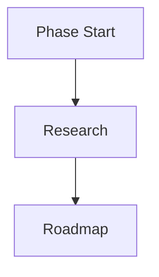

# Stack Research

**Domain:** VitePress documentation site — CLI framework docs with ASCII branding and Mermaid diagrams
**Researched:** 2026-03-18
**Confidence:** HIGH for core VitePress; MEDIUM for plugin versions; HIGH for deployment

---

## Scope

This research covers the stack needed for vit-cc's v1.1 documentation milestone:

- VitePress framework and configuration
- Mermaid diagram rendering
- ASCII art logo/branding in markdown
- Search integration
- GitHub Pages deployment via GitHub Actions

The existing vit-cc Node.js stack (gh CLI, Markdown agents, .planning/ system) is validated
and NOT re-evaluated here.

---

## Recommended Stack

### Core Technologies

| Technology | Version | Purpose | Why Recommended |
|------------|---------|---------|-----------------|
| VitePress | 1.6.4 (stable) | Static site generator for docs | Vue-team maintained; fastest build in class via Vite; Markdown-first; built-in default theme with sidebar/nav/search; widely adopted for CLI tool docs |
| Node.js | >=20 | Runtime | VitePress officially requires Node 20+; existing vit-cc engines field says >=18, docs package.json should target >=20 |
| Vue 3 | peer dep of VitePress | Component layer for custom theme slots | Required for any custom Vue components embedded in docs pages |

**Version note:** VitePress 2.0.0-alpha.16 is in active alpha development (latest pre-release as of
March 2026). The docs site at vitepress.dev now documents the alpha series, but stable production
use should target **1.6.4** until v2 exits alpha. Upgrade when v2 reaches stable — the alpha has
known regressions between releases.

### Supporting Libraries

| Library | Version | Purpose | When to Use |
|---------|---------|---------|-------------|
| vitepress-plugin-mermaid | 2.0.17 | Render Mermaid diagrams inside Markdown code blocks | Any page with architecture/flow diagrams; wraps the VitePress config with `withMermaid()` |
| mermaid | latest (^11.x) | Mermaid core renderer (peer dep) | Installed alongside vitepress-plugin-mermaid; required explicitly |

### Development Tools

| Tool | Purpose | Notes |
|------|---------|-------|
| GitHub Actions | CI/CD for GitHub Pages deployment | Official VitePress workflow uses `actions/upload-pages-artifact` and `actions/deploy-pages`; Node 24 recommended in workflow |
| Shiki | Syntax highlighting | Built into VitePress; no separate install needed; supports bash, js, ts, yaml, markdown out of the box |
| markdown-it | Markdown parser | Built into VitePress; no separate install; configure via `markdown:` key in config |

---

## Configuration Patterns

### VitePress Project Layout

```
docs/
  .vitepress/
    config.ts          # Main config with nav, sidebar, search
    theme/
      index.ts         # Extend default theme (optional)
      custom.css       # CSS overrides (monospace font, ASCII art sizing)
  index.md             # Home page (hero layout)
  guide/
    getting-started.md
    ...
  reference/
    commands.md
    agents.md
    ...
```

### Mermaid Integration

Install and wrap config:

```bash
npm install -D vitepress-plugin-mermaid mermaid
```

```typescript
// .vitepress/config.ts
import { withMermaid } from "vitepress-plugin-mermaid";

export default withMermaid({
  // All existing VitePress config goes here
  title: "vit-cc",
  description: "...",
  themeConfig: { /* ... */ },
  // Optional Mermaid config override
  mermaid: {
    // e.g. theme: 'neutral'
  },
});
```

Usage in any `.md` file:

````markdown

````

The plugin auto-detects dark/light theme on the `body` element, aligning diagram colors with the
VitePress theme toggle.

**Caveat (MEDIUM confidence):** A known breakage was reported for vitepress-plugin-mermaid with
some version pairings where peer dependency mismatches occur. Pin `vitepress-plugin-mermaid@2.0.17`
and `mermaid@^11.x` together and verify rendering on first setup. If issues arise, the fallback
is rendering Mermaid diagrams as static SVG images committed to the repo.

### ASCII Art Branding

ASCII art in VitePress renders correctly inside fenced code blocks or `<pre>` tags. No extra plugin
is needed.

**Recommended approach — fenced code block with no language tag:**

````markdown
```
 _   _ _ _
| | (_) | |
| |  _| | |
| |_| | | |
|_   _|_|_|  vit-cc
  |_|
```
````

This renders using VitePress's `--vp-font-family-mono` CSS variable (defaults to a system monospace
stack). To ensure consistent ASCII alignment across platforms, override the mono font in
`.vitepress/theme/custom.css`:

```css
:root {
  --vp-font-family-mono: "Cascadia Code", "Fira Code", ui-monospace,
    SFMono-Regular, Menlo, Monaco, Consolas, "Liberation Mono",
    "Courier New", monospace;
}
```

**Why NOT a `<pre>` tag with inline style:** Fenced code blocks are processed by Shiki and remain
valid Markdown on GitHub (renders as code block). A raw `<pre>` tag works in VitePress but renders
as literal HTML on GitHub — breaks the "Markdown that works everywhere" requirement.

### Search

VitePress ships with two built-in search providers. No plugin needed for either.

**Recommendation: local search (built-in)**

```typescript
themeConfig: {
  search: {
    provider: 'local'
  }
}
```

Local search uses a browser-side index built at site build time. Works without API keys, works
offline, zero cost. For vit-cc docs (CLI framework, not a large commercial product), this is
sufficient.

**Algolia DocSearch** is the alternative. It requires applying to the DocSearch program (free for
open source) and configuring `appId`/`apiKey`/`indexName`. Better at scale and offers Ask AI
features in DocSearch v4.5+. Use Algolia if the docs grow to many hundreds of pages or need
multi-language search.

### Deployment: GitHub Pages via GitHub Actions

**Recommendation: GitHub Pages** — zero-config hosting, stays within the existing GitHub
ecosystem, free for public repos.

Official workflow pattern (write to `.github/workflows/docs.yml`):

```yaml
name: Deploy docs to GitHub Pages

on:
  push:
    branches: [main]
  workflow_dispatch:

permissions:
  contents: read
  pages: write
  id-token: write

concurrency:
  group: pages
  cancel-in-progress: false

jobs:
  build:
    runs-on: ubuntu-latest
    steps:
      - uses: actions/checkout@v4
        with:
          fetch-depth: 0  # required for lastUpdated feature
      - uses: actions/setup-node@v4
        with:
          node-version: 24
          cache: npm
          cache-dependency-path: docs/package-lock.json
      - run: npm ci
        working-directory: docs
      - run: npm run docs:build
        working-directory: docs
      - uses: actions/upload-pages-artifact@v3
        with:
          path: docs/.vitepress/dist

  deploy:
    environment:
      name: github-pages
      url: ${{ steps.deployment.outputs.page_url }}
    needs: build
    runs-on: ubuntu-latest
    steps:
      - id: deployment
        uses: actions/deploy-pages@v4
```

Repository settings: Pages > Build and deployment > Source: **GitHub Actions**.

If the repo is deployed at a subpath (e.g. `user.github.io/vit-cc/`), set `base: '/vit-cc/'` in
`.vitepress/config.ts`.

**Alternatives:**
- **Vercel**: Zero-config, instant preview deployments per PR, custom domain easy. Requires setting
  `cleanUrls: true` in `vercel.json`. Good if preview URLs per PR are valuable.
- **Netlify**: Similar to Vercel; no extra config for clean URLs. Both require a Netlify/Vercel
  account.
- **GitHub Pages wins for this project** because no external account is needed and it matches
  the existing GitHub-native philosophy of vit-cc.

---

## Installation

Docs live in a `docs/` subdirectory with their own `package.json`:

```bash
# Create docs package
cd docs
npm init -y

# Core
npm install -D vitepress

# Mermaid support
npm install -D vitepress-plugin-mermaid mermaid

# Initialize VitePress (optional interactive wizard)
npx vitepress init
```

The `docs/package.json` scripts section should include:

```json
{
  "scripts": {
    "docs:dev": "vitepress dev",
    "docs:build": "vitepress build",
    "docs:preview": "vitepress preview"
  }
}
```

**Important:** `docs/package.json` must include `"type": "module"` because VitePress is ESM-only
and cannot be loaded via `require()`.

---

## Alternatives Considered

| Recommended | Alternative | When to Use Alternative |
|-------------|-------------|-------------------------|
| VitePress 1.6.4 | Docusaurus 3 | When React ecosystem is preferred, or when versioned docs are a hard requirement (Docusaurus has first-class versioning; VitePress does not) |
| VitePress 1.6.4 | Nextra (Next.js) | When MDX components with complex React interactivity are needed |
| VitePress 1.6.4 | MkDocs (Python) | When the team is Python-native; VitePress wins for JS/Node.js projects |
| vitepress-plugin-mermaid | Static SVG images | If plugin version conflicts are unresolvable; SVGs committed to repo always render correctly |
| Built-in local search | Algolia DocSearch | For docs sites with 200+ pages needing enterprise search |
| GitHub Pages | Vercel | When per-PR preview deployments are needed |

---

## What NOT to Use

| Avoid | Why | Use Instead |
|-------|-----|-------------|
| VitePress 2.0.0-alpha | Active regressions between alpha releases; peer dependency instability | VitePress 1.6.4 (stable) |
| VitePress `<script setup>` Vue components for ASCII art | Overkill; adds build complexity for static text | Fenced code block in Markdown |
| `vitepress-plugin-search` (third-party) | Superseded by VitePress's built-in local search provider (added in v1.x) | Built-in `provider: 'local'` |
| Raw `<pre>` tags for ASCII art | Renders as literal HTML on GitHub; breaks dual-render requirement | Fenced code block (no language) |
| `gh-pages` npm package for deployment | Works but requires a separate npm script; GitHub Actions workflow is more transparent and controllable | GitHub Actions workflow |

---

## Stack Patterns by Variant

**If docs and repo root are the same directory:**
- Set `srcDir: './docs'` in VitePress config at project root
- Use `base: '/'` for GitHub Pages on a `username.github.io` repo
- Because: avoids nested package.json; fine for small projects

**If docs are in a `docs/` subdirectory (recommended for vit-cc):**
- Separate `docs/package.json` with its own dependencies
- Keeps docs toolchain isolated from vit-cc's own (currently empty) dependencies
- GitHub Actions workflow uses `working-directory: docs`

**If architecture diagrams are complex (many node types, large graphs):**
- Use `mermaidConfig: { maxTextSize: 90000 }` in VitePress config to raise the default limit
- Because: Mermaid has a default character limit that can cause large diagrams to silently fail

**If dark mode diagram contrast is poor:**
- Override per-page via frontmatter: `mermaidTheme: base` or `mermaidTheme: neutral`
- Because: the default dark theme in Mermaid can be low-contrast on VitePress's dark background

---

## Version Compatibility

| Package | Compatible With | Notes |
|---------|-----------------|-------|
| vitepress@1.6.4 | Node.js >=20 | docs/package.json should set engines.node >= 20 |
| vitepress-plugin-mermaid@2.0.17 | vitepress@1.x, mermaid@^11.x | Pin both together; the plugin wraps VitePress config, so VitePress must be installed first |
| mermaid@^11.x | vitepress-plugin-mermaid@2.0.17 | Install as explicit devDependency, not relying on transitive resolution |
| GitHub Actions deploy-pages@v4 | ubuntu-latest runners | actions/upload-pages-artifact@v3 required as pair |

---

## Sources

- https://vitepress.dev/guide/getting-started — Node.js requirement (>=20), ESM-only constraint, installation commands (HIGH)
- https://github.com/vuejs/vitepress/releases — Confirmed 1.6.4 as latest stable; v2.0.0-alpha.16 as latest pre-release (HIGH)
- https://vitepress.dev/guide/deploy — GitHub Pages workflow structure, Vercel/Netlify notes, base path requirement (HIGH)
- https://vitepress.dev/guide/markdown — Built-in Markdown features: containers, code groups, GFM alerts, Shiki highlighting (HIGH)
- https://vitepress.dev/reference/default-theme-search — Built-in local search and Algolia DocSearch configuration (HIGH)
- https://emersonbottero.github.io/vitepress-plugin-mermaid/ — Plugin overview, dark theme detection, image support (MEDIUM — version confirmed as 2.0.17 from plugin docs header; peer dep versions not explicitly listed)
- https://www.npmjs.com/package/vitepress-plugin-mermaid — Version 2.0.17 confirmed (MEDIUM — direct fetch blocked 403; confirmed via search results)
- WebSearch: "VitePress mermaid diagrams integration plugin 2025 2026" — identified vitepress-plugin-mermaid as dominant option; vitepress-mermaid-renderer as interactive alternative (MEDIUM)
- WebSearch: "VitePress ASCII art preformatted text rendering monospace font" — confirmed fenced code block approach; CSS variable override pattern (MEDIUM — verified against VitePress custom.css docs)

---

*Stack research for: vit-cc documentation site (v1.1 milestone)*
*Researched: 2026-03-18*
