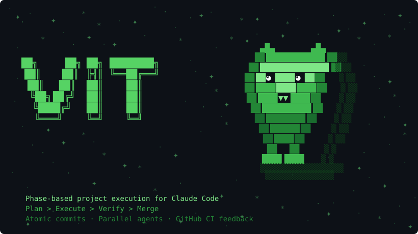

<div align="center">



<p>

[](https://github.com/LeVarez/vit-cc/stargazers)
[](https://github.com/LeVarez/vit-cc/watchers)
[](https://github.com/LeVarez/vit-cc/network/members)
[](https://github.com/LeVarez/vit-cc/issues)
[](https://github.com/LeVarez/vit-cc/blob/main/LICENSE)
[](https://github.com/LeVarez/vit-cc/commits)

</p>

</div>

Phase-based project execution framework for Claude Code — with GitHub integration.

> **Warning**
> This project is in an exploration and development phase. It is not recommended for production use. APIs, commands, and behavior may change without notice.

---

## What is ViT-claude?

ViT-claude is a Claude Code workflow framework. It installs as slash commands, specialist agents, and session hooks directly into your `.claude/` directory.

The core loop:

```
/vit:new-project  ->  /vit:plan-phase  ->  /vit:execute-phase  ->  /vit:verify-work
```

Each phase produces **atomic commits** on a feature branch, updates a `STATE.md` tracker, and optionally posts CI results back to the linked GitHub issue. **Parallel agents** handle research, planning, execution, testing, docs, and review simultaneously. When context fills up, `/vit:pause-work` creates a handoff document so the next session resumes exactly where you left off.

**State survives context resets.** All decisions, progress, and phase context live in `.planning/` files — not in Claude's memory.

---

## Install

```bash
npx vit-claude
```

What gets installed:

- 16 specialist agents (`.claude/agents/vit-*.md`)
- 31 slash commands (`.claude/commands/vit/*.md`)
- 2 session hooks (`vit-check-update.cjs`, `vit-statusline.js`)
- Core references, templates, workflows (`.claude/vit/`)
- GitHub CI workflow (`.github/workflows/phase-ci.yml`) — opt-in
- Hook registrations in `.claude/settings.json`

Run `npx vit-claude` again at any time to update. Your `.planning/` data is never touched.

---

## Quick Start

**1. Initialize your project**

```
/vit:new-project
```

Claude gathers deep context through adaptive questioning, then produces `PROJECT.md` + a phased `ROADMAP.md`.

**2. Plan a phase**

```
/vit:plan-phase 1
```

Spawns a researcher and planner in parallel. Produces a `PLAN.md` with task breakdown, wave assignments, and verification criteria. A plan checker validates it before you execute.

**3. Execute the plan**

```
/vit:execute-phase 1
```

Spawns parallel executor agents per wave. Each task gets an atomic commit. After all waves complete: integration check, test generation, and doc update run automatically. Results push to your feature branch and CI posts to the linked GitHub issue.

**4. Verify the work**

```
/vit:verify-work 1
```

A verifier agent runs goal-backward analysis and produces `VERIFICATION.md`. If all criteria pass, the draft PR is promoted to ready and a PR reviewer posts inline comments.

---

```
━━━━━━━━━━━━━━━━━━━━━━━━━━━━━━━━━━━━━━━━━━━━━━━━━━━━━
 ViT-claude ► COMMANDS REFERENCE
━━━━━━━━━━━━━━━━━━━━━━━━━━━━━━━━━━━━━━━━━━━━━━━━━━━━━
```

## Commands Reference

31 commands organized into 11 groups. Each command is a slash command invoked as `/vit:<name>`.

### Project Init

```
───────────────────────────────────────────
 PROJECT INIT
───────────────────────────────────────────
```

| Command | Description | Usage | Produces |
|---------|-------------|-------|----------|
| `/vit:new-project` | Initialize a new project with deep context gathering and PROJECT.md | `/vit:new-project` | `PROJECT.md`, `ROADMAP.md`, `REQUIREMENTS.md`, `STATE.md`, `config.json` |
| `/vit:new-milestone` | Start a new milestone cycle — update PROJECT.md and route to requirements | `/vit:new-milestone v1.1.0 Notifications` | `PROJECT.md`, `ROADMAP.md`, `REQUIREMENTS.md`, `STATE.md` |
| `/vit:map-codebase` | Analyze codebase with parallel mapper agents to produce .planning/codebase/ documents | `/vit:map-codebase` | `.planning/codebase/` (7 documents) |

### Planning

```
───────────────────────────────────────────
 PLANNING
───────────────────────────────────────────
```

| Command | Description | Usage | Produces |
|---------|-------------|-------|----------|
| `/vit:plan-phase` | Create detailed execution plan for a phase (PLAN.md) with verification loop | `/vit:plan-phase 3` | `{phase}-PLAN.md` files, `{phase}-RESEARCH.md` |
| `/vit:discuss-phase` | Gather phase context through adaptive questioning before planning | `/vit:discuss-phase 3` | `{phase}-CONTEXT.md` |
| `/vit:research-phase` | Research how to implement a phase (standalone — usually use /vit:plan-phase instead) | `/vit:research-phase 3` | `{phase}-RESEARCH.md` |
| `/vit:list-phase-assumptions` | Surface Claude's assumptions about a phase approach before planning | `/vit:list-phase-assumptions 3` | None |

### Execution

```
───────────────────────────────────────────
 EXECUTION
───────────────────────────────────────────
```

| Command | Description | Usage | Produces |
|---------|-------------|-------|----------|
| `/vit:execute-phase` | Execute all plans in a phase with wave-based parallelization | `/vit:execute-phase 3` | Committed code, `{plan}-SUMMARY.md` files, updated `STATE.md` |
| `/vit:quick` | Execute a quick task with ViT-claude guarantees (atomic commits, state tracking) but skip optional agents | `/vit:quick` | Committed code, `STATE.md` update |

### Verification

```
───────────────────────────────────────────
 VERIFICATION
───────────────────────────────────────────
```

| Command | Description | Usage | Produces |
|---------|-------------|-------|----------|
| `/vit:verify-work` | Validate built features through conversational UAT | `/vit:verify-work 3` | `{phase}-UAT.md` |
| `/vit:audit-milestone` | Audit milestone completion against original intent before archiving | `/vit:audit-milestone v1.0.0` | `{version}-MILESTONE-AUDIT.md` |

### Progress

```
───────────────────────────────────────────
 PROGRESS
───────────────────────────────────────────
```

| Command | Description | Usage | Produces |
|---------|-------------|-------|----------|
| `/vit:progress` | Check project progress, show context, and route to next action (execute or plan) | `/vit:progress` | None |
| `/vit:list-milestones` | Show all active milestone worktrees and their current state | `/vit:list-milestones` | None |

### Roadmap

```
───────────────────────────────────────────
 ROADMAP
───────────────────────────────────────────
```

| Command | Description | Usage | Produces |
|---------|-------------|-------|----------|
| `/vit:add-phase` | Add phase to end of current milestone in roadmap | `/vit:add-phase Add authentication` | Updated `ROADMAP.md` |
| `/vit:insert-phase` | Insert urgent work as decimal phase (e.g., 72.1) between existing phases | `/vit:insert-phase 3 Fix critical bug` | Updated `ROADMAP.md` |
| `/vit:remove-phase` | Remove a future phase from roadmap and renumber subsequent phases | `/vit:remove-phase 5` | Updated `ROADMAP.md` |
| `/vit:plan-milestone-gaps` | Create phases to close all gaps identified by milestone audit | `/vit:plan-milestone-gaps` | Updated `ROADMAP.md`, new `PLAN.md` files |

### Session

```
───────────────────────────────────────────
 SESSION
───────────────────────────────────────────
```

| Command | Description | Usage | Produces |
|---------|-------------|-------|----------|
| `/vit:pause-work` | Create context handoff when pausing work mid-phase | `/vit:pause-work` | `.continue-here.md` |
| `/vit:resume-work` | Resume work from previous session with full context restoration | `/vit:resume-work` | None |

### Team

```
───────────────────────────────────────────
 TEAM
───────────────────────────────────────────
```

| Command | Description | Usage | Produces |
|---------|-------------|-------|----------|
| `/vit:assign-phase` | Assign a phase or individual plan to an engineer | `/vit:assign-phase 3 @alice` | Updated `PLAN.md` files, updated `STATE.md` |
| `/vit:team-status` | Show team assignment status — who's working on what, what's blocked, what's unassigned | `/vit:team-status` | None |

### Maintenance

```
───────────────────────────────────────────
 MAINTENANCE
───────────────────────────────────────────
```

| Command | Description | Usage | Produces |
|---------|-------------|-------|----------|
| `/vit:complete-milestone` | Archive completed milestone and prepare for next version | `/vit:complete-milestone v1.0.0` | `milestones/v1.0.0/` archive, git tag |
| `/vit:review-feedback` | Read developer feedback on a GitHub feature issue and implement requested changes | `/vit:review-feedback 3` | Atomic commits per change |
| `/vit:debug` | Systematic debugging with persistent state across context resets | `/vit:debug login fails on mobile` | `.planning/debug/{issue}.md` |

### Config

```
───────────────────────────────────────────
 CONFIG
───────────────────────────────────────────
```

| Command | Description | Usage | Produces |
|---------|-------------|-------|----------|
| `/vit:settings` | Configure ViT-claude workflow toggles and model profile | `/vit:settings` | Updated `config.json` |
| `/vit:set-profile` | Switch model profile for ViT-claude agents (quality/balanced/budget) | `/vit:set-profile balanced` | Updated `config.json` |
| `/vit:update` | Update ViT-claude to latest version with changelog display | `/vit:update` | Updated `.claude/vit/` files |

### Meta

```
───────────────────────────────────────────
 META
───────────────────────────────────────────
```

| Command | Description | Usage | Produces |
|---------|-------------|-------|----------|
| `/vit:help` | Show available ViT-claude commands and usage guide | `/vit:help` | None |
| `/vit:join-discord` | Join the ViT-claude Discord community | `/vit:join-discord` | None |
| `/vit:add-todo` | Capture idea or task as todo from current conversation context | `/vit:add-todo refactor auth module` | `.planning/todos/pending/{todo}.md` |
| `/vit:check-todos` | List pending todos and select one to work on | `/vit:check-todos` | None |

---

```
━━━━━━━━━━━━━━━━━━━━━━━━━━━━━━━━━━━━━━━━━━━━━━━━━━━━━
 ViT-claude ► AGENTS REFERENCE
━━━━━━━━━━━━━━━━━━━━━━━━━━━━━━━━━━━━━━━━━━━━━━━━━━━━━
```

## Agents Reference

ViT-claude spawns 16 specialist agents automatically — you don't invoke them directly.

| Agent | Spawned By | Role | Output |
|-------|------------|------|--------|
| `vit-planner` | `/vit:plan-phase` | Creates executable phase plans with task breakdown, dependency analysis, and goal-backward verification | PLAN.md files |
| `vit-executor` | `/vit:execute-phase` | Executes ViT-claude plans with atomic commits, deviation handling, checkpoint protocols, and state management | Per-task commits, SUMMARY.md |
| `vit-verifier` | `/vit:execute-phase` | Verifies phase goal achievement through goal-backward analysis — checks codebase delivers what phase promised, not just that tasks completed | VERIFICATION.md |
| `vit-phase-researcher` | `/vit:plan-phase` | Researches how to implement a phase before planning; produces RESEARCH.md consumed by vit-planner | RESEARCH.md |
| `vit-plan-checker` | `/vit:plan-phase` | Verifies plans will achieve phase goal before execution via goal-backward analysis of plan quality | Plan quality report |
| `vit-project-researcher` | `/vit:new-project`, `/vit:new-milestone` | Researches domain ecosystem before roadmap creation; produces files in `.planning/research/` consumed during roadmap creation | `.planning/research/*.md` |
| `vit-research-synthesizer` | `/vit:new-project` | Synthesizes research outputs from parallel researcher agents into a unified SUMMARY.md | `.planning/research/SUMMARY.md` |
| `vit-roadmapper` | `/vit:new-project` | Creates project roadmaps with phase breakdown, requirement mapping, success criteria derivation, and coverage validation | ROADMAP.md |
| `vit-codebase-mapper` | `/vit:map-codebase` | Explores codebase and writes structured analysis documents for a given focus area (tech, arch, quality, concerns) | `.planning/codebase/*.md` |
| `vit-integration-checker` | `/vit:audit-milestone` | Verifies cross-phase integration and E2E flows — checks that phases connect properly and user workflows complete end-to-end | Integration audit report |
| `vit-debugger` | `/vit:debug` | Investigates bugs using scientific method, manages debug sessions, handles checkpoints | Debug session file |
| `vit-github-reviewer` | `/vit:review-feedback` | Reads GitHub issue feedback comments for a phase and implements requested changes as fix commits | Fix commits + GitHub reply |
| `vit-test-writer` | `/vit:execute-phase` | Generates Vitest unit tests from phase plan must_haves and SUMMARY.md deliverables | Test files |
| `vit-pr-reviewer` | `/vit:verify-work` | Reviews promoted PRs and posts severity-tiered findings as GitHub review comments | GitHub PR review comments |
| `vit-doc-updater` | `/vit:execute-phase` | Updates targeted documentation sections after a phase completes, reading SUMMARY.md and PLAN.md to identify which docs/sections to update | Updated docs + CHANGELOG entry |
| `vit-changelog-writer` | `/vit:complete-milestone` | Writes versioned CHANGELOG entry at milestone completion and updates all project documentation by reading all phase SUMMARY.md files | CHANGELOG.md versioned entry |

---

```
━━━━━━━━━━━━━━━━━━━━━━━━━━━━━━━━━━━━━━━━━━━━━━━━━━━━━
 ViT-claude ► SETTINGS REFERENCE
━━━━━━━━━━━━━━━━━━━━━━━━━━━━━━━━━━━━━━━━━━━━━━━━━━━━━
```

## Settings Reference

ViT-claude is configured through `.planning/config.json` in your project root. All settings are optional — defaults work out of the box.

### config.json Keys

| Key | Default | Description |
|-----|---------|-------------|
| `mode` | `"yolo"` | Execution mode: `yolo` = no confirmations, `interactive` = confirm each step |
| `depth` | `"standard"` | Planning depth: `quick`, `standard`, or `comprehensive` |
| `parallelization` | `true` | Enable parallel agent spawning in execute-phase |
| `commit_docs` | `true` | Commit `.planning/` artifacts to git |
| `model_profile` | `"balanced"` | Agent model selection profile: `quality`, `balanced`, or `budget` |
| `workflow.research` | `true` | Enable research step in plan-phase |
| `workflow.plan_check` | `true` | Enable plan checker before execution |
| `workflow.verifier` | `true` | Enable verifier after execution |
| `team.enabled` | `false` | Enable team mode for multi-engineer collaboration |
| `team.roster` | `[]` | Array of `{"handle": "alice", "role": "backend"}` engineer objects |
| `team.default_reviewer` | `""` | GitHub handle for auto-assigning PR reviewer |

**Sample config.json with all defaults:**

```json
{
  "mode": "yolo",
  "depth": "standard",
  "parallelization": true,
  "commit_docs": true,
  "model_profile": "balanced",
  "workflow": {
    "research": true,
    "plan_check": true,
    "verifier": true
  },
  "team": {
    "enabled": false,
    "roster": [],
    "default_reviewer": ""
  }
}
```

### Model Profile Matrix

Control which Claude model each agent uses to balance quality vs. token spend.

| Agent | `quality` | `balanced` | `budget` |
|-------|-----------|------------|----------|
| `vit-planner` | opus | opus | sonnet |
| `vit-roadmapper` | opus | sonnet | sonnet |
| `vit-executor` | opus | sonnet | sonnet |
| `vit-phase-researcher` | opus | sonnet | haiku |
| `vit-project-researcher` | opus | sonnet | haiku |
| `vit-research-synthesizer` | sonnet | sonnet | haiku |
| `vit-debugger` | opus | sonnet | sonnet |
| `vit-codebase-mapper` | sonnet | haiku | haiku |
| `vit-verifier` | sonnet | sonnet | haiku |
| `vit-plan-checker` | sonnet | sonnet | haiku |
| `vit-integration-checker` | sonnet | sonnet | haiku |

**Profile explanations:**

- **quality** — Maximum reasoning: Opus for all decision-making agents. Use when quota is available and architecture quality is critical.
- **balanced** (default) — Smart allocation: Opus only for planning where architecture decisions happen, Sonnet for execution and verification.
- **budget** — Minimal Opus: Sonnet for code generation, Haiku for research and verification. Use when conserving quota or running high-volume work.

**Switching profiles:**

```bash
/vit:set-profile quality    # or balanced, budget
```

Or edit `.planning/config.json` directly:

```json
{
  "model_profile": "quality"
}
```

---

```
━━━━━━━━━━━━━━━━━━━━━━━━━━━━━━━━━━━━━━━━━━━━━━━━━━━━━
 ViT-claude ► GITHUB CI INTEGRATION
━━━━━━━━━━━━━━━━━━━━━━━━━━━━━━━━━━━━━━━━━━━━━━━━━━━━━
```

## GitHub CI Integration

`phase-ci.yml` triggers automatically on every push to `feature/**`, `milestone/**`, and `quick/**` branches.

**How it finds your issue:**

Branch names follow the pattern `feature/v1.6.0-01-api-foundation`. The workflow extracts the milestone and phase number, then looks up the corresponding GitHub issue number from `.planning/STATE.md`. No manual linking needed.

**What it posts to the issue:**

```
✅ CI Passed — Phase v1.6.0/01 @ abc1234
Branch: feature/v1.6.0-01-api-foundation
Tests: 24/24 passed
All unit tests green. Ready for human review.
Run /vit:verify-work 1 to complete manual UAT.
```

```
❌ CI Failed — Phase v1.6.0/01 @ abc1234
Branch: feature/v1.6.0-01-api-foundation
Tests: 20/24 passed — 4 failing
### Failing tests
  ...
Fix failures before running /vit:verify-work 1.
```

```
🔄 CI — Phase v1.6.0/01 @ abc1234
Branch: feature/v1.6.0-01-api-foundation
Status: No phase tests yet — waiting for test generation
Tests are created by vit-test-writer after phase execution completes.
```

**Test location:** `tests/phases/` — the `vit-test-writer` agent generates these automatically after phase execution. If no tests exist yet, the workflow posts the "waiting" comment instead of failing.

**Feedback loop:** Use `/vit:review-feedback` to read developer comments posted to the issue and implement changes as fix commits — a complete review cycle without leaving the terminal.

**Requires:** `GITHUB_TOKEN` in your repo secrets (automatically available in GitHub Actions — no setup needed).

---

```
━━━━━━━━━━━━━━━━━━━━━━━━━━━━━━━━━━━━━━━━━━━━━━━━━━━━━
 ViT-claude ► ARCHITECTURE
━━━━━━━━━━━━━━━━━━━━━━━━━━━━━━━━━━━━━━━━━━━━━━━━━━━━━
```

## Architecture

```
/vit:plan-phase
    ├── vit-phase-researcher    (parallel) → RESEARCH.md
    ├── vit-planner                        → PLAN.md with task waves
    └── vit-plan-checker                   → goal-backward verification

/vit:execute-phase
    ├── gh pr create --draft               (idempotent, milestone-targeted)
    ├── Wave 1: [vit-executor] [vit-executor] ...   (parallel tasks)
    ├── Wave 2: [vit-executor] ...
    ├── vit-integration-checker            → cross-wave integration check
    ├── vit-test-writer                    → tests/phases/
    ├── vit-doc-updater                    → README/docs + CHANGELOG [Unreleased]
    └── git push → phase-ci.yml → GitHub issue comment

/vit:verify-work
    ├── vit-verifier                       → VERIFICATION.md
    ├── gh pr ready                        (Route A: all pass, phases remain)
    └── vit-pr-reviewer                    → GitHub inline review comments
```

All state is stored in `.planning/STATE.md`, `.planning/MILESTONE.md`, and per-phase `PLAN.md` files. State survives context resets and session boundaries.

---

```
━━━━━━━━━━━━━━━━━━━━━━━━━━━━━━━━━━━━━━━━━━━━━━━━━━━━━
 ViT-claude ► PROJECT STRUCTURE
━━━━━━━━━━━━━━━━━━━━━━━━━━━━━━━━━━━━━━━━━━━━━━━━━━━━━
```

## Project Structure

**`.planning/` — per-project state (created by `/vit:new-project`)**

```
.planning/
├── PROJECT.md              # Vision, scope, requirements, decisions
├── REQUIREMENTS.md         # Categorized requirements with REQ-IDs
├── ROADMAP.md              # Phase structure with success criteria
├── STATE.md                # Current position and GitHub issue mapping
├── MILESTONE.md            # Active milestone tracker
├── config.json             # Workflow preferences
├── codebase/               # Codebase analysis (from /vit:map-codebase)
├── research/               # Domain research (from /vit:new-project)
└── phases/
    ├── 01-phase-name/
    │   ├── 01-RESEARCH.md
    │   ├── 01-01-PLAN.md
    │   ├── 01-02-PLAN.md
    │   ├── 01-01-SUMMARY.md
    │   └── 01-02-SUMMARY.md
    └── 02-phase-name/
        └── ...
```

**`.claude/` — framework files (installed by `npx vit-claude`)**

```
.claude/
├── agents/
│   └── vit-*.md            # 16 specialist agent system prompts
├── commands/
│   └── vit/
│       └── *.md            # 31 slash command definitions
├── hooks/
│   ├── vit-check-update.cjs  # Version check at session start
│   └── vit-statusline.js     # Status sidebar renderer
├── settings.json             # Hook registrations
└── vit/
    ├── references/           # Best practice guides and patterns
    ├── templates/            # Document templates (PLAN, SUMMARY, STATE, ...)
    └── workflows/            # Orchestration workflow definitions
```

---

```
━━━━━━━━━━━━━━━━━━━━━━━━━━━━━━━━━━━━━━━━━━━━━━━━━━━━━
 ViT-claude ► COMMON WORKFLOWS
━━━━━━━━━━━━━━━━━━━━━━━━━━━━━━━━━━━━━━━━━━━━━━━━━━━━━
```

## Common Workflows

### 1. Greenfield — start a new project from scratch

Initialize ViT-claude on a blank repo. Claude asks questions to understand your vision, then builds a complete roadmap.

```
/vit:new-project
/vit:plan-phase 1
/vit:execute-phase 1
/vit:verify-work 1
```

Repeat plan/execute/verify for each phase. When a milestone is complete: `/vit:audit-milestone` then `/vit:complete-milestone`.

---

### 2. Brownfield — adopt ViT-claude on an existing codebase

Start with a codebase analysis so the planner understands what already exists before building the roadmap.

```
/vit:map-codebase
/vit:new-project
/vit:plan-phase 1
```

`/vit:map-codebase` produces structured analysis in `.planning/codebase/` that the planner reads automatically.

---

### 3. Resume — pick up after a context reset

After starting a new Claude Code session, restore full context instantly.

```
/vit:resume-work
```

Reads `STATE.md`, the active phase plan, and any handoff documents. Shows exactly where you are and what to do next.

---

### 4. Urgent work — insert a hotfix between planned phases

Need to ship something urgently without disrupting the roadmap?

```
/vit:insert-phase
```

Inserts as a decimal phase (e.g., `2.1`) between existing phases and renumbers subsequent phases automatically. After the hotfix: continue from where the roadmap left off.

---

### 5. Team collaboration — assign phases and track handoffs

Enable team mode in `.planning/config.json`, then assign phases to engineers.

```
/vit:settings
/vit:assign-phase 3
/vit:team-status
```

`/vit:assign-phase` records the assignee in STATE.md. `/vit:team-status` shows all phases, assignees, and current progress across the milestone.

---

### 6. Debugging — systematic investigation with persistent state

Use the structured debugging workflow for tricky bugs that need investigation across multiple sessions.

```
/vit:debug
```

Spawns `vit-debugger`, which applies a scientific method approach: hypothesis, reproduction, isolation, fix. Debug state persists across context resets so you can pick up mid-investigation.

---

```
━━━━━━━━━━━━━━━━━━━━━━━━━━━━━━━━━━━━━━━━━━━━━━━━━━━━━
 ViT-claude ► UPDATE
━━━━━━━━━━━━━━━━━━━━━━━━━━━━━━━━━━━━━━━━━━━━━━━━━━━━━
```

## Update

```bash
npx vit-claude      # Re-run to update (overwrites framework files, preserves your .planning/ data)
/vit:update         # Or use the in-session command
```

ViT-claude checks for updates automatically at session start via the `vit-check-update` hook.

---

## Built On

ViT-claude is built on top of [Get Shit Done](https://github.com/gsd-build/get-shit-done) — a structured methodology for shipping software with AI agents.

Created by [@LeVarez](https://github.com/LeVarez). Contributions and feedback welcome.

---

## License & Community

MIT License

- [GitHub Issues](https://github.com/LeVarez/vit-cc/issues) — bug reports, feature requests
- [Discord](https://discord.gg/vit-claude) — community, help, announcements
- [Docs](https://levarez.github.io/vit-cc/) — full documentation site
