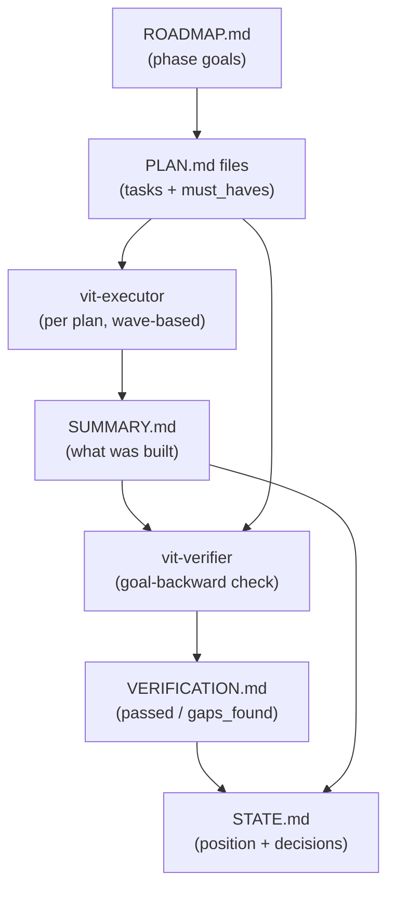

# Architecture Deep Dive

This page explains how VIT is built internally: the orchestrator pattern that drives command execution, how wave-based parallelization works, the goal-backward verification system, and the model profile configuration.

For the user-facing workflow, see [How VIT Works](/guide/how-vit-works).
For workflow file implementation details, see [Workflow Files](/guide/workflow-files).

---

## The Orchestrator Pattern

Every VIT command is an orchestrator. Commands define *what* to do — they discover plans, group them by wave, and spawn agents. Agents define *how* to do it — they read the execution workflow and implement the tasks.

This separation keeps the orchestrator lean (10–15% context usage) while giving each agent a full, fresh context window (200k).

### Example: execute-phase

The `/vit:execute-phase` command orchestrates plan execution without doing any implementation itself:

```
1. Resolve model profile (quality / balanced / budget)
2. Verify worktree and branch setup
3. Pull latest state (freshness check)
4. Create a draft GitHub PR
5. Discover all PLAN.md files in the phase
6. Group plans by wave number
7. For each wave: spawn vit-executor agents in parallel
8. Wait for all agents in wave to complete
9. Verify phase goal (spawn vit-verifier)
10. Update ROADMAP.md and STATE.md
11. Push to remote, offer next steps
```

The command reads plans, inlines their content, and passes it to subagents via `Task()`. The `@` syntax for file references does not work across Task() boundaries — content must be inlined in the prompt.

```bash
# Orchestrator reads plan content before spawning
PLAN_CONTENT=$(cat "$WORK_DIR/$PLAN_PATH")
STATE_CONTENT=$(cat "$WORK_DIR/.planning/STATE.md")

# Then spawns agent with inlined content
Task(
  prompt="Execute plan at {plan_path}

  Plan:
  {plan_content}

  Project state:
  {state_content}",
  subagent_type="vit-executor",
  model="claude-sonnet-4-5"
)
```

Each spawned agent reads `execute-plan.md` for its execution workflow and handles everything: task implementation, per-task commits, deviation handling, and SUMMARY.md creation. SUMMARY.md output is structured by the templates and references in `.claude/vit/` — see [Templates and References](/guide/templates-references) for the full list.

---

## Wave Parallelization

Plans within a phase are assigned to execution waves during planning. Wave numbers appear in PLAN.md frontmatter:

```yaml
---
phase: 02-docs-site
plan: 03
wave: 2
depends_on: ["02-01", "02-02"]
---
```

Wave 1 plans run in parallel. Wave 2 plans start only after all Wave 1 plans complete. This creates a dependency graph without explicit dependency tracking — the planner assigns waves, and the executor respects them.

### Example: 5-plan phase

```
Wave 1: [01-database-schema, 02-api-routes]    ← run in parallel
Wave 2: [03-frontend-components]               ← waits for Wave 1
Wave 3: [04-integration, 05-documentation]     ← waits for Wave 2
```

The orchestrator spawns all plans in a wave simultaneously with multiple `Task()` calls in a single message. The `Task()` tool blocks until all parallel agents return.

### Context efficiency

| Role | Context Budget |
|------|---------------|
| Orchestrator (execute-phase) | ~10–15% |
| Each executor (per plan) | Fresh 200k |
| Verifier | Fresh 200k |

Because each plan runs in a fresh agent, quality stays consistent regardless of phase size. A 10-plan phase doesn't degrade more than a 2-plan phase.

### State flow diagram



---

## Goal-Backward Verification

Completing tasks is not the same as achieving the phase goal. A task "create chat component" can be marked complete when the component is a stub. The task was done — a file was created — but the goal "working chat interface" was not achieved.

VIT uses goal-backward verification to catch this gap.

### The must_haves System

Each PLAN.md declares `must_haves` in its frontmatter. These are checked by the verifier *against the actual codebase*, not against the executor's self-report.

```yaml
must_haves:
  truths:
    - "A reader understands the VIT core loop after reading How VIT Works"
    - "VitePress builds without errors"
  artifacts:
    - path: "docs/guide/how-vit-works.md"
      provides: "Core loop explanation"
      min_lines: 100
  key_links:
    - from: "docs/guide/how-vit-works.md"
      to: "docs/guide/architecture.md"
      via: "cross-link for deeper dive"
      pattern: "\\[Architecture.*\\]\\(/guide/architecture\\)"
```

**Truths** are observable behaviors from the reader/user perspective. They're written as statements that should be true after execution — verifiable by a human using the actual system.

**Artifacts** are files that must exist with substantive content. The verifier checks:
1. Does the file exist?
2. Is it substantive (not a stub)? Minimum line count, no placeholder patterns.
3. Is it wired? (For code: imported and used. For docs: linked from navigation.)

**Key links** are critical connections between files. For documentation: links that must exist between pages. For code: component → API calls, API → database queries.

### Verification Outcomes

After checking all must_haves, the verifier produces one of three outcomes:

| Status | Meaning | Next Step |
|--------|---------|-----------|
| `passed` | All must_haves verified | Promote PR, offer next phase |
| `gaps_found` | One or more must_haves failed | Generate fix plans, re-execute |
| `human_needed` | Automated checks pass but visual/UX verification needed | Present checklist to user |

When `gaps_found`, the verifier generates fix plan recommendations grouped by gap cluster. The user runs `/vit:plan-phase <N> --gaps` to create these fix plans, then `/vit:execute-phase <N> --gaps-only` to run only them. The verifier re-runs after each gap closure cycle.

### Why not just trust the executor?

Executors can:
- Mark a task complete when the implementation is a stub
- Miss wiring between components
- Implement the task but not the goal

The verifier has no stake in the executor's success — it reads the codebase fresh and checks observable outcomes. This separation is why VIT catches gaps that self-reporting misses.

---

## Model Profile System

VIT agents run at different quality levels depending on what they do. The model profile system maps agents to Claude models based on a configurable profile.

### Three Profiles

| Agent | `quality` | `balanced` | `budget` |
|-------|-----------|------------|----------|
| vit-planner | opus | opus | sonnet |
| vit-roadmapper | opus | sonnet | sonnet |
| vit-executor | opus | sonnet | sonnet |
| vit-phase-researcher | opus | sonnet | haiku |
| vit-project-researcher | opus | sonnet | haiku |
| vit-research-synthesizer | sonnet | sonnet | haiku |
| vit-debugger | opus | sonnet | sonnet |
| vit-codebase-mapper | sonnet | haiku | haiku |
| vit-verifier | sonnet | sonnet | haiku |
| vit-plan-checker | sonnet | sonnet | haiku |
| vit-integration-checker | sonnet | sonnet | haiku |

**quality** — Maximum reasoning power. Opus for all decision-making agents. Use during critical architecture work when quality matters most.

**balanced** (default) — Opus only for planning (where architecture decisions happen), Sonnet for execution and verification. Smart allocation: high quality where it counts, efficient everywhere else.

**budget** — Sonnet for implementation, Haiku for research and verification. Use for high-volume work or when conserving API quota.

### Profile Philosophy

The model choice per agent reflects what each agent does:

**Why Opus for vit-planner in balanced?**
Planning involves architecture decisions and goal decomposition. This is where model quality has the highest leverage — a good plan enables fast execution; a bad plan causes gaps that require fix cycles.

**Why Sonnet for vit-executor?**
Executors follow explicit PLAN.md instructions. The reasoning is already in the plan; execution is implementation.

**Why Sonnet (not Haiku) for vit-verifier?**
Verification requires goal-backward reasoning — checking if code *delivers* what the phase promised, not just pattern matching against filenames. Haiku may miss subtle gaps.

**Why Haiku for vit-codebase-mapper?**
Read-only exploration and structured output from file contents. No reasoning required.

### Setting the Profile

```bash
# Change at runtime
/vit:set-profile quality

# Set project default in .planning/config.json
{
  "model_profile": "balanced"
}
```

---

## Checkpoint System

Some plans require human interaction mid-execution. These are marked `autonomous: false` in frontmatter. When an executor reaches a checkpoint task, it stops and returns a structured state message to the orchestrator.

The orchestrator presents the checkpoint to the user (verification steps, decision needed, or action required). After the user responds, the orchestrator spawns a *fresh* continuation agent — not a resumed agent — with the completed tasks table as context.

This is more reliable than resuming: fresh agents have full context, resumed agents may have context corruption from parallel tool calls.

### Checkpoint Types

**checkpoint:human-verify** — The executor built something (deployed, configured, generated). The user visits a URL or inspects output, then types "approved" or describes issues.

**checkpoint:decision** — A choice is needed before implementation can continue (e.g., which authentication approach). The user selects an option.

**checkpoint:human-action** — Something with no CLI/API alternative (e.g., clicking a link in an email, entering a 2FA code). Rare — only when automation is genuinely impossible.

---

## GitHub Integration

VIT maintains automatic GitHub synchronization throughout execution:

- **Draft PR created** when a phase starts executing
- **Sub-issue checkboxes updated** after each plan completes
- **PR promoted to ready-for-review** when verification passes
- **Feature issue closed** with a summary comment after phase completion
- **Dependency notifications** posted when a phase unblocks downstream phases

All GitHub operations use the `gh` CLI and are non-blocking — if `gh` is unavailable or a call fails, execution continues.
