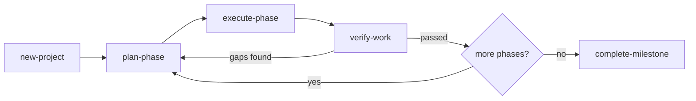

# How VIT Works

VIT is a structured workflow for building software with Claude. Rather than issuing one-off prompts, you work through a repeatable loop: define what you want to build, break it into plans, execute each plan, and verify the result. Every step produces a documented artifact that feeds the next.

This page explains the core loop, how state is managed across sessions, and how VIT handles the constraint of AI context windows.

For implementation details, see the [Architecture Deep Dive](/guide/architecture).

---

## The Core Loop

VIT operates as a four-stage cycle. Each stage produces artifacts and triggers GitHub actions automatically:



The diagram below shows how the VIT workflow maps to GitHub operations at each stage:

```mermaid
sequenceDiagram
    participant U as User
    participant VIT as VIT CLI
    participant GH as GitHub

    rect rgb(60, 60, 80)
    Note over U,GH: Stage 1 — Initialize
    U->>VIT: /vit:new-project
    VIT->>VIT: Create .planning/ (PROJECT, ROADMAP, REQUIREMENTS)
    U->>VIT: /vit:new-milestone
    VIT->>GH: Create milestone/vX.Y branch
    VIT->>GH: Create GitHub Milestone
    VIT->>GH: Create feature issue per phase
    VIT->>GH: Create sub-issues per plan
    VIT->>GH: Create feature branches (feature/vX.Y-NN-slug)
    end

    rect rgb(60, 70, 60)
    Note over U,GH: Stage 2 — Plan
    U->>VIT: /vit:plan-phase N
    VIT->>VIT: Research phase, create PLAN.md files
    VIT->>GH: Create plan branches (feature/vX.Y-NN-PP)
    VIT->>GH: Link branches to sub-issues
    end

    rect rgb(70, 60, 60)
    Note over U,GH: Stage 3 — Execute
    U->>VIT: /vit:execute-phase N
    VIT->>GH: Create draft PR → milestone branch
    VIT->>VIT: Spawn executor agents per plan
    VIT->>GH: Push commits per task
    VIT->>GH: Merge plan branches → feature branch
    VIT->>GH: Check off sub-issue checkboxes
    VIT->>GH: CI runs tests, reports to issue
    end

    rect rgb(60, 60, 70)
    Note over U,GH: Stage 4 — Verify
    U->>VIT: /vit:verify-work N
    VIT->>VIT: Check must_haves against codebase
    alt passed
        VIT->>GH: Promote PR to ready-for-review
        VIT->>GH: PR reviewer posts inline comments
        VIT->>GH: Close feature issue
    else gaps found
        VIT->>GH: Comment gaps on feature issue
        VIT-->>U: Run /vit:plan-phase N --gaps
    end
    end
```



### Stage 1: new-project

`/vit:new-project` initializes the project structure. It runs a discovery and requirements phase, produces a ROADMAP.md with all phases, and creates the `.planning/` directory tree.

**What it produces:**
- `.planning/PROJECT.md` — project context, constraints, core value
- `.planning/REQUIREMENTS.md` — checkable requirements
- `.planning/ROADMAP.md` — phase-by-phase breakdown with goals

**GitHub integration:** When followed by `/vit:new-milestone`, VIT creates a `milestone/vX.Y` branch, a GitHub milestone, and a feature issue per phase with sub-issues per plan. The entire issue hierarchy is established before any code is written.

**What triggers the next stage:**
The ROADMAP.md exists with at least one phase defined.

---

### Stage 2: plan-phase

`/vit:plan-phase <N>` plans a single phase. The vit-planner agent reads the phase goal from ROADMAP.md and decomposes it into 2–3 task PLAN.md files. Plans are not documents that get transformed into prompts — they *are* the prompts that executors will run.

**What it produces:**
- `PLAN.md` files in the phase directory, one per plan
- Each plan has a wave number (for parallelization), task list, verification criteria, and `must_haves`

**GitHub integration:** Plan branches (`feature/vX.Y-NN-PP`) are created per plan, linked to sub-issues via `gh issue develop`. STATE.md tracks the full mapping: phase → feature issue → branch → PR → sub-issues.

**What triggers the next stage:**
At least one PLAN.md without a matching SUMMARY.md exists.

---

### Stage 3: execute-phase

`/vit:execute-phase <N>` executes all plans in a phase. Plans in the same wave run in parallel; waves run sequentially. Each plan is handed to a vit-executor agent that works through its tasks, commits each one, and creates a SUMMARY.md.

**What it produces:**
- Code, config, and documentation changes committed per-task
- `SUMMARY.md` for each plan documenting what was built

**GitHub integration:** A draft PR is created against the milestone branch at the start of execution. As each plan completes, its plan branch is merged into the feature branch, sub-issue checkboxes are checked off in the feature issue, and commits are pushed to the remote. The CI workflow (`phase-ci.yml`) runs tests on each push and reports results back to the issue.

**What triggers the next stage:**
All PLAN.md files have a matching SUMMARY.md.

---

### Stage 4: verify-work

`/vit:verify-work <N>` checks that the phase goal was achieved — not just that tasks were completed. The vit-verifier agent reads the `must_haves` from each PLAN.md and checks the actual codebase against them.

**What it produces:**
- `VERIFICATION.md` with status (`passed`, `gaps_found`, or `human_needed`)
- If gaps_found: recommended fix plans and a call to `/vit:plan-phase --gaps`

**GitHub integration:** When verification passes, the draft PR is promoted to ready-for-review, the vit-pr-reviewer agent posts inline code comments, and the feature issue is closed. If gaps are found, the issue stays open with a comment summarizing what's missing.

**What triggers the next stage:**
`VERIFICATION.md` status is `passed`. Execution continues with the next phase, or moves to `complete-milestone` if all phases are done.

---

## State Management

VIT uses the `.planning/` directory as the project's persistent memory. Every agent reads from it at startup and writes back after completing its work. Sessions can be interrupted and resumed because all state is in files.

### The Key Files

**`.planning/STATE.md`** is the short-term memory. Every workflow reads it first. It contains:
- Current position (which phase, which plan)
- Recent decisions that constrain future work
- Blockers and concerns carried forward
- A progress bar across all plans

**`.planning/ROADMAP.md`** tracks the full execution plan. It lists every phase, its goal, its success criteria, and its completion status. The orchestrator reads this to know what to run next.

**`.planning/PROJECT.md`** is the long-term context. It contains the core value proposition, constraints, key decisions made across all phases, and the GitHub issue mapping.

**`SUMMARY.md` files** (one per plan) record what was actually built — not what was planned. They document deviations, decisions made, and files created or modified.

### How State Flows

```
ROADMAP.md → identifies phase goal
PLAN.md    → contains tasks + must_haves
executor   → commits per task, writes SUMMARY.md
verifier   → reads must_haves, writes VERIFICATION.md
STATE.md   → updated with new position + decisions
```

When you start a new session, the agent reads STATE.md and instantly knows where you left off: which phase, which plan, and any blockers to watch for.

---

## Context Resilience

LLM context windows are finite. A long-running project will eventually exceed the context budget of a single session. VIT is designed for this constraint.

### The 50% Context Budget Rule

Plans are designed to complete within roughly 50% of the available context window. Quality degrades as context fills:

| Context Usage | Quality |
|---------------|---------|
| 0–30% | Peak — thorough, comprehensive |
| 30–50% | Good — confident, solid work |
| 50–70% | Degrading — efficiency mode |
| 70%+ | Poor — rushed, minimal |

Keeping plans small (2–3 tasks) means each plan completes in its own fresh context, maintaining peak quality throughout.

### Fresh Agents Per Plan

When `/vit:execute-phase` runs, it spawns a separate agent for each plan. Each agent starts with a clean 200k context window and reads only what it needs. The orchestrator itself uses roughly 10–15% of context for coordination — it never accumulates the implementation details.

This is why VIT uses the `Task()` tool to spawn subagents rather than executing everything in the orchestrator's context.

### The `.continue-here` File

If a plan with checkpoints is interrupted mid-execution, the agent writes a `.continue-here` file to the phase directory. STATE.md records its path in the `Resume file:` field. A fresh agent can pick up from exactly where execution stopped, using the completed tasks table to know what commits already exist.

### Summary-Based History Loading

Instead of re-reading all code, agents load context through summaries. When a plan needs to know what previous plans built, it reads their SUMMARY.md files — typically 50–100 lines each — rather than the full codebase. This keeps context lean while preserving the essential history.

---

## The .planning/ Directory

```
.planning/
├── PROJECT.md          # Core value, constraints, key decisions
├── REQUIREMENTS.md     # Checkable requirements with phase mapping
├── ROADMAP.md          # Phase goals, success criteria, completion status
├── STATE.md            # Current position, session continuity, progress
├── config.json         # Model profile, feature flags
└── phases/
    └── v1.1/
        └── 02-docs-site/
            ├── 02-01-PLAN.md         # Task list + must_haves
            ├── 02-01-SUMMARY.md      # What was built
            ├── 02-02-PLAN.md
            ├── 02-02-SUMMARY.md
            └── 02-VERIFICATION.md    # Goal achievement report
```

**PLAN.md** is the execution prompt. It contains the objective, context file references, a task list with verification criteria, and `must_haves` (truths, artifacts, key_links) that the verifier will check.

**SUMMARY.md** is written by the executor after the plan completes. It documents what was actually built, any deviations from the plan (auto-fixed bugs, missing critical functionality that was added), and the key decisions made.

**VERIFICATION.md** is written by the verifier. It records whether each `must_have` was satisfied, any gaps found, and recommended fix plans if the phase goal was not fully achieved.

---

## Deviation Handling

Execution is not mechanical. Agents encounter bugs, missing dependencies, and incomplete implementations. VIT handles these with automatic deviation rules:

1. **Rule 1 — Auto-fix bugs:** Wrong behavior gets fixed immediately and documented.
2. **Rule 2 — Auto-add critical functionality:** Missing error handling, security checks, or validation gets added.
3. **Rule 3 — Auto-fix blockers:** Missing dependencies or broken imports get resolved to unblock the task.
4. **Rule 4 — Ask about architectural changes:** New tables, infrastructure, or API contract changes require user approval.

All deviations are recorded in SUMMARY.md. The goal is complete transparency — you can always see exactly what was done beyond the plan.

---

## What VIT Is Not

VIT is not a framework that wraps Claude. It's a set of conventions: file formats, workflow files, and command definitions that any Claude Code project can adopt. The `.claude/vit/` directory in your project contains all of these — workflows, templates, references, agent definitions, and command files.

Everything VIT does, you could do manually. VIT automates the coordination and record-keeping so you can focus on what you want to build.
