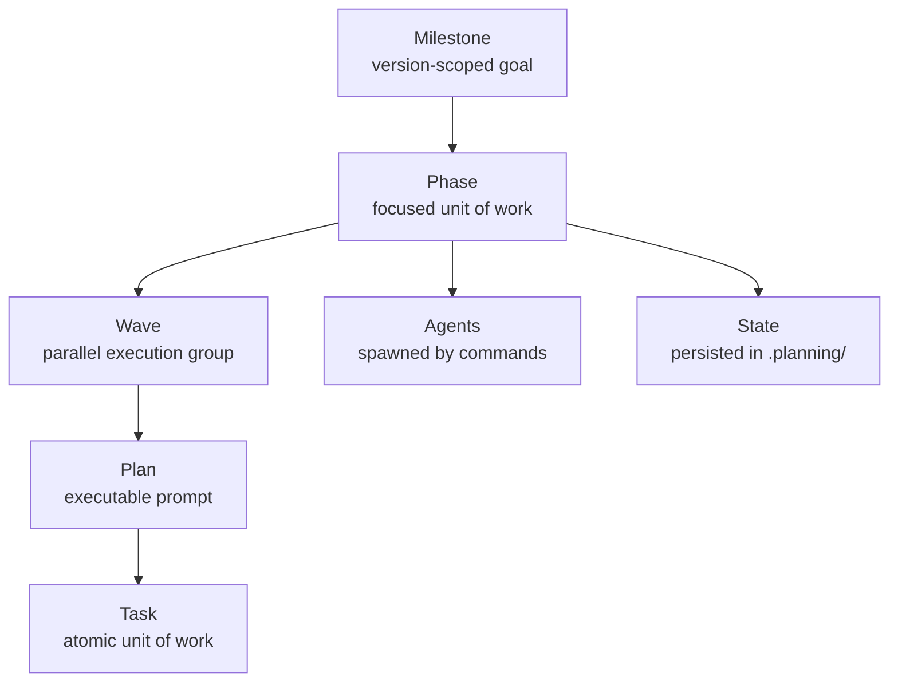

# Core Concepts

VIT organizes work into a hierarchy: milestones contain phases, phases contain plans,
plans contain tasks. Commands drive the lifecycle — they tell VIT what to do next.
Agents do the work — they are specialist Claude instances that plan, execute, verify,
and document. State persists across sessions in the `.planning/` folder, so every new
context window can pick up exactly where the last one left off. This page explains the
mental model behind VIT so you understand why the system is structured the way it is.

## The VIT Hierarchy

The hierarchy is strict: work flows from the top down. A milestone defines what version
is being built. Phases break that version into focused efforts. Plans break phases into
small, parallelizable chunks. Tasks are where actual changes happen — each one produces
an atomic commit. The diagram above shows the structural relationships; agent spawn
relationships and the full command graph are covered in the Phase 02 Agent Reference.

## Milestones

A milestone is a version-scoped unit of work, such as `v1.0` or `v1.1`. It has a goal
statement and a set of requirements that define what "done" looks like for that version.
A milestone contains multiple phases, executed sequentially — each phase responsible for
a distinct area of the system. The milestone lifecycle moves through: `new-milestone`
(initialization) → phases (execution) → `audit` (quality review) → `complete-milestone`
(close out). Milestones appear in `.planning/ROADMAP.md` and drive the phase sequence
from start to finish. They are the top-level planning artifact: everything VIT produces
belongs to a milestone.

## Phases

A phase is a focused unit of work within a milestone. Each phase has a clear goal,
explicit success criteria, and a set of requirements inherited from the milestone.
Phases produce code or documentation on a dedicated feature branch, keeping work
isolated until it is reviewed and merged. The phase lifecycle is: `plan-phase` (the
planner agent designs the plans and waves) → `execute-phase` (executor agents run the
plans) → `verify-work` (the verifier checks output against must_haves). A phase maps
to a GitHub issue and a pull request — it is the unit of work that becomes reviewable
by a human. Phases within a milestone run sequentially, but plans within a phase can
run in parallel via waves.

## Plans

A plan is an executable prompt — a `PLAN.md` file containing 2-3 tasks, frontmatter
metadata, and a `must_haves` verification spec. Plans are created by the `vit-planner`
agent during `plan-phase` and executed by `vit-executor` agents during `execute-phase`.
They are grouped into waves to maximize parallelism: all Wave 1 plans run simultaneously;
Wave 2 starts only after all Wave 1 plans complete. Plan frontmatter includes `depends_on`
(which earlier plans must finish first), `files_modified` (which files will change), and
`must_haves` (goal-backward truths that must hold after execution). Each plan is small
enough to complete in a single focused Claude session, which keeps commits atomic and
diffs reviewable. See [Glossary — PLAN.md](glossary.md#planmd) for the file format.

## Tasks

A task is a single unit of work inside a plan. Each task has a `files` list (which files
it touches), an `action` (what to do), a `verify` (how to confirm it worked), and a
`done` condition (the signal that the task is complete). Tasks come in two types: `auto`
means Claude completes the task autonomously without pausing; `checkpoint` means execution
pauses and a human must review, approve, or make a decision before work continues. Every
completed task produces an atomic git commit, so any task can be independently reverted,
bisected, or inspected in isolation. Tasks are the lowest granularity in VIT — they do
not subdivide further. The checkpoint mechanism is what makes human-in-the-loop review
practical without breaking the automation flow. See [Glossary — checkpoint](glossary.md#checkpoint).

## Waves

A wave is a group of plans that execute in parallel within a phase. Wave numbers are
assigned by the planner based on dependencies: a plan goes into Wave 2 if it requires
output from a Wave 1 plan; otherwise it goes into Wave 1. Within a wave, all plans run
simultaneously using separate Claude instances in separate git worktrees, so they do not
block each other. Wave-based parallelism is what makes VIT significantly faster than
sequential AI coding: a phase with 6 plans in 2 waves completes in roughly the time of
3 sequential plans. Wave assignments are stored in each plan's frontmatter under the
`wave` field and respected by `execute-phase` when it spawns executor agents.

## Agents

Agents are specialist Claude instances spawned by VIT commands. They are not invoked
directly by the user — commands orchestrate them behind the scenes, passing them the
right context and plan files. Each agent has a defined role and a narrow scope of
responsibility, which keeps the system composable and each agent's behavior predictable.
Key agents in the default VIT setup include:

- `vit-researcher`: Researches the domain before planning begins, producing a `RESEARCH.md`
  file with standard stack, architecture patterns, and pitfalls to avoid
- `vit-planner`: Designs the plans for a phase, creating `PLAN.md` files with tasks,
  waves, and must_haves
- `vit-plan-checker`: Reviews plans for quality, feasibility, and completeness before
  execution begins
- `vit-executor`: Executes a single plan, committing each task atomically and producing
  a `SUMMARY.md`
- `vit-verifier`: Verifies a completed phase against its must_haves and success criteria
- `vit-doc-updater`: Updates documentation files after code changes land

A full agent reference — with each agent's trigger conditions, inputs, outputs, and
configuration options — is part of Phase 02 (Command and Agent Reference).

## State

VIT persists all project state in the `.planning/` folder. `STATE.md` is the central
file: it records the current position (which milestone, phase, and plan), accumulated
decisions, active blockers, and session continuity information. `ROADMAP.md` defines
the milestone and phase sequence. Each phase folder contains its `PLAN.md` files and
the `SUMMARY.md` completion records produced after each plan executes. State survives
context resets — every new Claude session begins by reading `STATE.md` to understand
exactly where work stands, what decisions have been made, and what to do next. The
`/vit:pause-work` command checkpoints the current session explicitly, writing a
`.continue-here` file that tells the next session exactly where to resume;
`/vit:resume-work` reads that file and restores context.

## See also

- [Getting Started](getting-started.md) — hands-on tutorial: install VIT and run your first phase
- [Glossary](glossary.md) — definitions for all VIT-specific terms used in this page and across the framework
